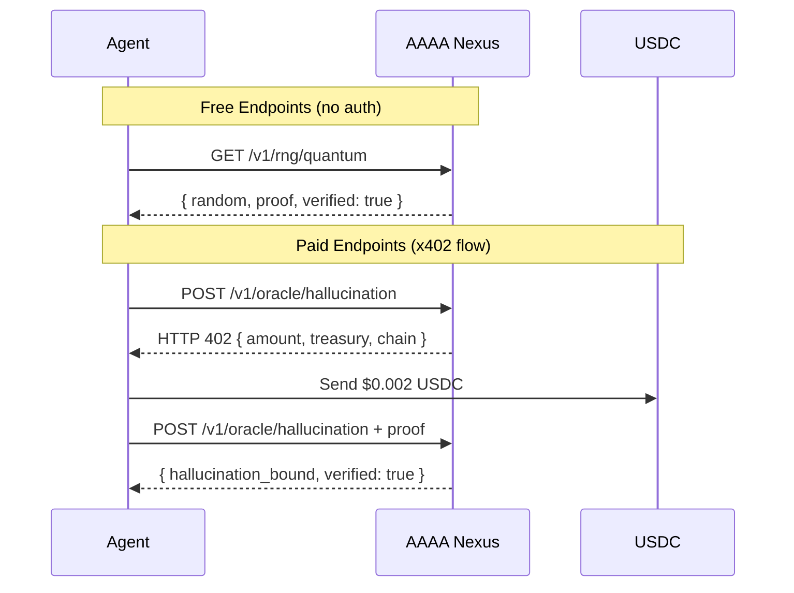
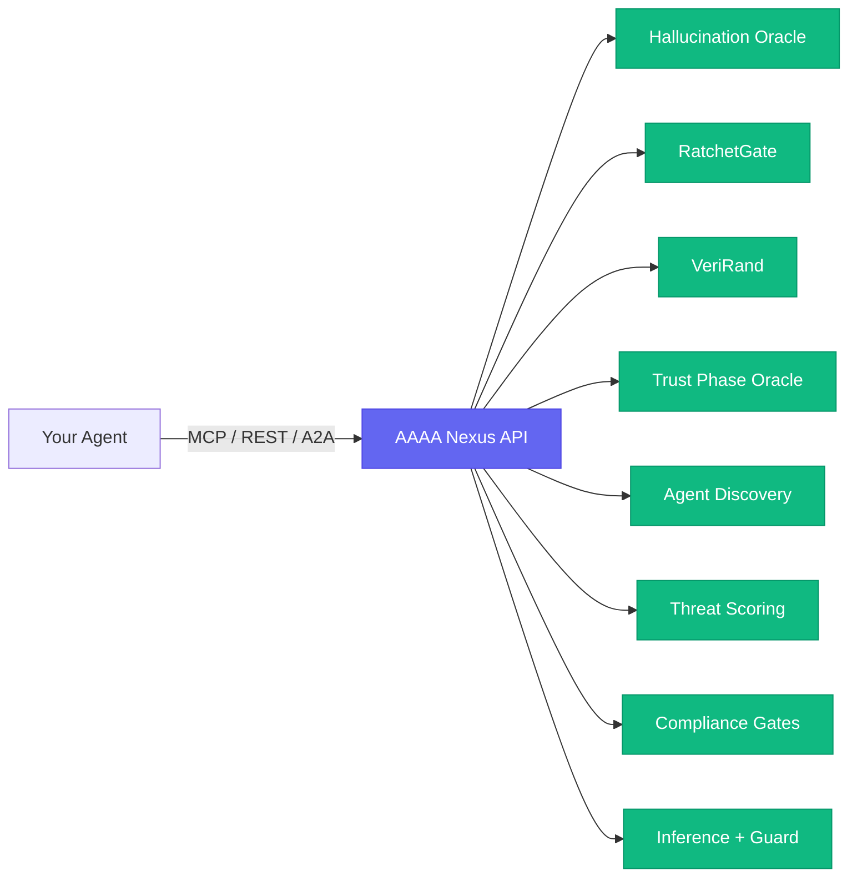

# AAAA Nexus — Formally Verified AI Safety Infrastructure

[](https://atomadic.tech)
[](#verify-our-claims)
[](https://atomadic.tech/openapi.json)
[](https://atomadic.tech/mcp)
[](https://atomadic.tech/.well-known/agent.json)
[](https://github.com/atomadictech/aaaa-nexus/actions/workflows/verify.yml)
[](./LICENSE)

**The only AI safety API where every guarantee is mathematically proved — not benchmarked, not tested, _proved_.**

Production-grade infrastructure for autonomous agents with built-in x402 USDC micropayments, Google A2A protocol, and MCP server compatibility.

> **Star this repo** to follow updates and new endpoint releases.

---

## Try It Now (Zero Setup)

```bash
curl https://atomadic.tech/v1/rng/quantum
```

That's it. No signup, no API key, no SDK. You just got a cryptographically verified random number from a formally verified system.

<details>
<summary>Expected response</summary>

```json
{
  "random": "0x7f3a8c2e9d1b4a6f...",
  "bits": 256,
  "source": "quantum",
  "verified": true,
  "epoch": 17409216
}
```
</details>

**More free endpoints:**

```bash
curl https://atomadic.tech/health
curl https://atomadic.tech/v1/oracle/entropy
curl -X POST https://atomadic.tech/v1/agents/register \
  -H "Content-Type: application/json" \
  -d '{"agent_id": "my-agent", "capabilities": ["inference"]}'
```

---

## The Problem

Autonomous agents operating without human oversight face six critical infrastructure gaps:

| Gap | Risk |
|-----|------|
| **Session hijacking** | Credential theft via MCP session fixation |
| **Undetected hallucinations** | Agents act on fabricated information |
| **No agent accountability** | Rogue agents with zero traceability |
| **Unauditable randomness** | "Random" outputs that can be predicted or replayed |
| **Unbounded delegation** | Infinite agent spawning without limits |
| **No economic framework** | No way for agents to pay each other |

## The Solution

**129 API endpoints across 22 product families** — every safety claim backed by formal proofs in Lean 4.

### Core Products

| Product | What It Does |
|---------|-------------|
| **Hallucination Oracle** | Certified upper bound on hallucination probability |
| **RatchetGate** | Session re-keying that prevents session fixation |
| **VeriRand** | Cryptographically verified quantum randomness |
| **Trust Phase Oracle** | Mathematical trust scoring with proved ceiling |
| **Topological Identity** | Sybil-resistant agent verification |
| **AAAA Shield** | Post-quantum session security |
| **Agent Discovery** | A2A-compatible agent registry and topology |
| **SLA Engine** | Enforceable service-level agreements between agents |
| **Agent Escrow** | Trustless payment escrow for agent-to-agent work |
| **Reputation Ledger** | On-chain reputation tracking |
| **Text Processing** | Summarization, sentiment, NER, translation, embeddings (12 endpoints) |
| **Delegation Control** | UCAN chains with proved depth limits |
| **Key Management** | Generate, rotate, and revoke cryptographic keys |
| **Audit Trail** | Tamper-proof logging, trails, and export |
| **Credits & Billing** | Balance, purchase, usage history |

---

## How It Works





---

## Verify Our Claims

**Don't trust us. Verify.**

We run automated verification daily against the live API. You can also run it yourself:

```bash
git clone https://github.com/atomadictech/aaaa-nexus.git
cd aaaa-nexus
./verify.sh
```

The verifier checks:
- All endpoints respond correctly
- Paid endpoints enforce x402 payment protocol
- Free endpoints return expected data structures
- Formal proof fields are present in API responses

See [`verify.sh`](./verify.sh) for the full script. [View CI results](https://github.com/atomadictech/aaaa-nexus/actions/workflows/verify.yml).

---

## MCP Server — Add to Claude / Cursor in 30 Seconds

```json
{
  "mcpServers": {
    "aaaa-nexus": {
      "url": "https://atomadic.tech/mcp"
    }
  }
}
```

Works with Claude Desktop, Claude Code, Cursor, and any MCP-compatible client.

---

## x402 Payment Flow

No signup. No API keys. Agents pay autonomously with USDC.

```
1. Call any paid endpoint        -> HTTP 402 with payment details
2. Send USDC to treasury         -> Base L2, Polygon, or Solana
3. Retry with payment proof      -> Get result
```

Or get an **API key** for bulk calls: https://atomadic.tech/pay

### Pricing

Starting at **$0.002/call**. Credit packs: $4 (500 calls) / $15 (2,000) / $49 (7,500). Credits never expire. [Full pricing](./docs/PRICING.md).

---

## A2A Protocol

Fully compatible with Google A2A:

```bash
# Discover capabilities
curl https://atomadic.tech/.well-known/agent.json

# Register your agent
curl -X POST https://atomadic.tech/v1/agents/register \
  -H "Content-Type: application/json" \
  -d '{"agent_id": "my-agent", "capabilities": ["inference"]}'

# View swarm topology
curl https://atomadic.tech/v1/agents/topology
```

---

## Integration Examples

| Framework | Guide | Difficulty |
|-----------|-------|-----------|
| **cURL** | [examples/curl.md](./examples/curl.md) | Copy-paste |
| **TypeScript** | [examples/typescript.md](./examples/typescript.md) | 5 min |
| **Python** | [examples/python.md](./examples/python.md) | 5 min |
| **MCP (Claude/Cursor)** | [examples/mcp.md](./examples/mcp.md) | 30 sec |
| **LangChain** | [examples/langchain.md](./examples/langchain.md) | 10 min |
| **CrewAI** | [examples/crewai.md](./examples/crewai.md) | 10 min |
| **AutoGen** | [examples/autogen.md](./examples/autogen.md) | 10 min |
| **Postman** | [Import collection](./examples/aaaa-nexus.postman_collection.json) | 1 min |

See [`examples/responses/`](./examples/responses/) for sample API responses.

---

## How AAAA Nexus Compares

| | AAAA Nexus | Benchmark-Based | Heuristic Guardrails |
|---|-----------|----------------|---------------------|
| **Safety proof** | Mathematical (Lean 4) | Statistical | Rule-based |
| **Coverage** | All inputs | Sampled cases | Known patterns |
| **Agent payments** | x402 USDC (autonomous) | None | None |
| **MCP + A2A** | Native | Varies | No |
| **Session security** | Formally proved | Token-based | Token-based |

[Full comparison](./docs/COMPARISON.md)

---

## Documentation

| Doc | Description |
|-----|-------------|
| [Quick Start](./docs/QUICK_START.md) | Up and running in 5 minutes |
| [Pricing](./docs/PRICING.md) | Tiers, credit packs, x402 rates |
| [Use Cases](./docs/USE_CASES.md) | 7 concrete scenarios with code |
| [FAQ](./docs/FAQ.md) | Common questions answered |
| [Glossary](./docs/GLOSSARY.md) | Formal verification terminology |
| [Comparison](./docs/COMPARISON.md) | AAAA Nexus vs alternatives |
| [Product Brief](./PRODUCT_BRIEF.md) | What we're building and why |
| [Changelog](./CHANGELOG.md) | Version history |
| [OpenAPI Spec](./openapi.json) | Machine-readable API spec |
| [Security Policy](./SECURITY.md) | Responsible disclosure |
| [Contributing](./CONTRIBUTING.md) | How to contribute |

**For AI agents:** Read [`llms.txt`](./llms.txt) for a concise reference or [`llms-full.txt`](./llms-full.txt) for complete endpoint documentation.

---

## Quick Links

| Resource | URL |
|----------|-----|
| **Live API** | https://atomadic.tech |
| **Get API Key** | https://atomadic.tech/pay |
| **OpenAPI Spec** | https://atomadic.tech/openapi.json |
| **MCP Server** | https://atomadic.tech/mcp |
| **A2A Agent Card** | https://atomadic.tech/.well-known/agent.json |
| **Health / Status** | https://atomadic.tech/health |

---

## Contact

- **Email:** atomadic@proton.me
- **Issues:** [GitHub Issues](https://github.com/atomadictech/aaaa-nexus/issues)

---

## License

Documentation, examples, and the verification script: **CC BY-ND 4.0**.
The underlying API, algorithms, proofs, and infrastructure: **Proprietary**.
This repository contains no source code.

© 2026 Atomadic Tech. All rights reserved.
